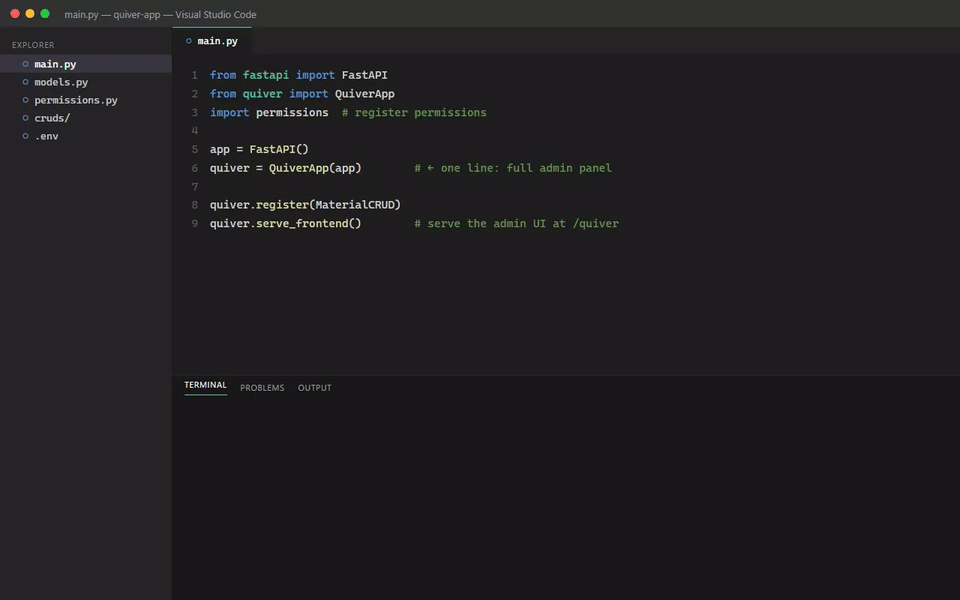
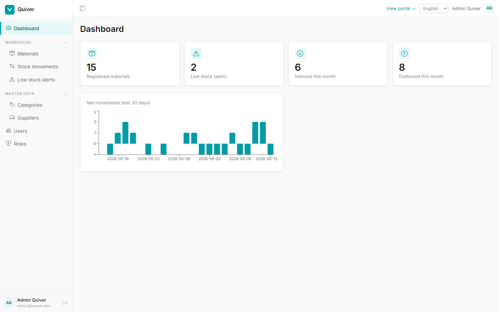
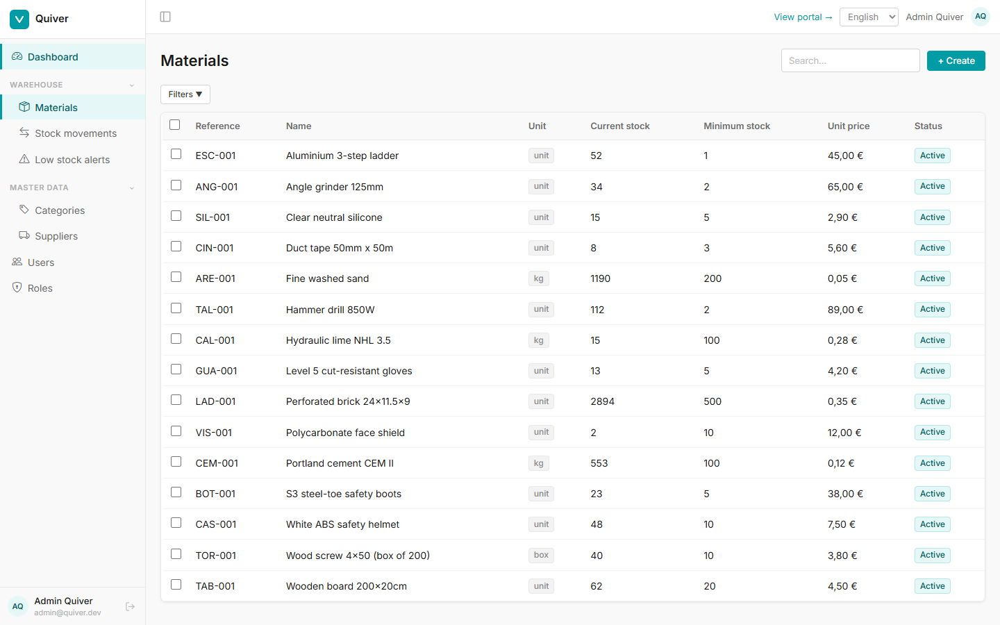
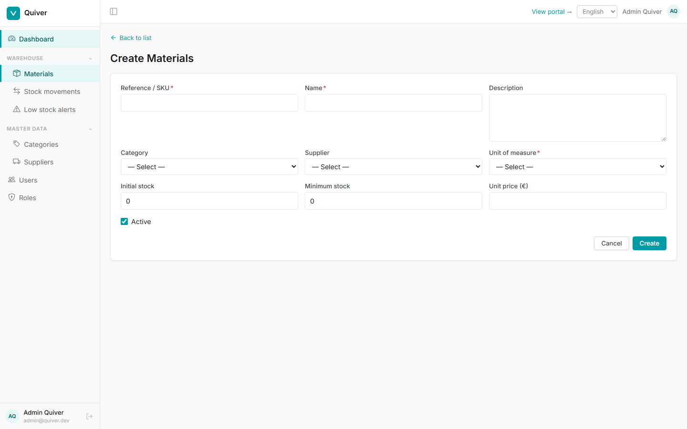
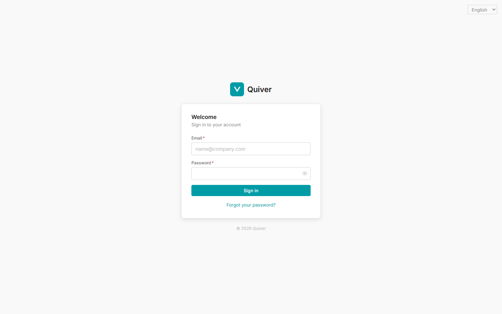

<p align="center">
  
</p>

<p align="center">
  <a href="https://github.com/rnkr69/quiver/actions/workflows/ci.yml"></a>
  <a href="https://pypi.org/project/fastapi-quiver/"></a>
  <a href="https://pypi.org/project/fastapi-quiver/"></a>
  <a href="LICENSE"></a>
</p>

**A complete admin panel and user portal for any FastAPI + SQLModel app — declared in Python.**

Quiver is a library, not a standalone app. Mount it on your existing FastAPI application in
one line, declare your CRUDs, widgets, pages and permissions in Python, and get a full admin
panel (list/create/edit/delete UI, dashboard, RBAC) plus a client portal — without writing
any frontend code.

> 🇪🇸 *Este README está disponible también en [español](README.es.md).*

<p align="center">
  
</p>

<p align="center"><sub>▶️ Watch the full walkthrough (with audio): <a href="assets/quiver-demo.mp4">assets/quiver-demo.mp4</a> — login, dashboard and auto-generated CRUD</sub></p>

---

## How it works

- **Backend** (`fastapi-quiver`, the installable package) generates REST endpoints and serves
  the entire UI definition (columns, fields, filters, menu, pages) from your Python declarations.
- **Frontend** is a generic Vite + React + TypeScript SPA that reads everything from the backend
  at runtime — so adding a new admin resource needs **zero frontend changes**.

```python
# main.py
from fastapi import FastAPI
from quiver import QuiverApp
import permissions  # noqa: F401 — register permissions at import time

app = FastAPI()
quiver = QuiverApp(app)  # mounts auth, RBAC, users, dashboard, menu, pages and portal
```

---

## Quick start

### 1. Install the backend package

```bash
pip install fastapi-quiver
```

<sub>Installing from source instead? See the [installation guide](docs/01-installation.md).</sub>

### 2. Configure the environment

`SECRET_KEY` and `DATABASE_URL` are required (see [`.env.example`](.env.example)):

```env
SECRET_KEY=change-me
DATABASE_URL=sqlite:///./app.db
```

### 3. Mount Quiver, run migrations and create the first user

```bash
quiver db migrate          # apply Quiver's auth/RBAC migrations
quiver create-superuser    # interactive first-user creation
uvicorn main:app --reload  # API served under /quiver/v1
```

### 4. Serve the admin UI

The published wheel **bundles the built SPA**. Mount it at the end of your setup (after
registering your CRUDs) and it is served at `/quiver`, with the API under `/quiver/v1`:

```python
quiver.serve_frontend()   # serves the admin/portal at /quiver
```

Open `http://localhost:8000/quiver/` — no separate frontend process needed.

**Developing the frontend?** Run the SPA from [`frontend/`](frontend/) with hot reload instead;
it serves at `http://localhost:5173/quiver/` and proxies the API to your backend:

```bash
npm install
npm run dev
```

> `serve_frontend()` is a no-op if no build is present, so running the SPA separately just works.
> The SPA base path (`/quiver`) is configurable via `QUIVER_FRONTEND_PATH` (backend) and
> `VITE_BASE_PATH` (frontend) — keep them in sync.

---

## Documentation

| Document | Contents |
|---|---|
| [Installation](docs/01-installation.md) | Install the backend, configure env vars, set up the frontend |
| [Quick start](docs/02-quick-start.md) | First CRUD, first widget — a working app in 20 minutes |
| [CRUD engine](docs/03-crud.md) | Fields, columns, filters, lifecycle hooks, permissions |
| [Dashboard](docs/04-dashboard.md) | StatCards, charts, per-widget permissions |
| [Roles & permissions](docs/05-rbac.md) | Defining permissions, creating roles, protecting routes |
| [Menu](docs/06-menu.md) | Structure of the admin sidebar |
| [Custom pages](docs/07-custom-pages.md) | Arbitrary React pages in the admin or portal |
| [User portal](docs/08-portal.md) | Client portal: access roles, customization |
| [Frontend](docs/09-frontend.md) | Design tokens, components, layouts |
| [Examples](docs/10-examples.md) | Ready-to-run reference projects |

*Spanish versions of these guides live under [`docs/es/`](docs/es/).*

---

## Example app

[`examples/almacen/`](examples/almacen/) is a complete reference host app (warehouse
management): 4 interconnected CRUDs, stock movements with business logic, dashboard widgets,
custom permissions and a custom page. It is the best place to see how a consumer wires
everything up.

---

## Requirements

- Python 3.11+
- Node.js 18+ (for the frontend only)
- PostgreSQL or SQLite (for development)
- An existing FastAPI project using SQLModel as its ORM

---

## What Quiver gives you

- **Full authentication** — login, JWT access/refresh tokens, password reset by email
- **Automatic CRUD** — declare a SQLModel model and get list/create/edit/delete with UI included
- **Dashboard** — configurable StatCards and charts backed by your database
- **Roles & permissions** — granular RBAC, assigned from the UI
- **User portal** — a separate area for your clients, with its own roles
- **Custom pages** — drop your own React pages into the admin or portal
- **Configurable menu** — structure the sidebar with groups, items and permission control
- **Internationalization** — English/Spanish UI out of the box (react-i18next) with a language switcher; auto-detects the browser language and is easy to extend with new locales

---

## Screenshots

| Dashboard | Auto-generated CRUD list |
|---|---|
|  |  |
| **Auto-generated form** | **Login** |
|  |  |

<sub>Screenshots from the [`examples/almacen`](examples/almacen/) reference app.</sub>

---

## Contributing

Contributions are welcome — see [CONTRIBUTING.md](CONTRIBUTING.md).

## License

[MIT](LICENSE) © rnkr69
